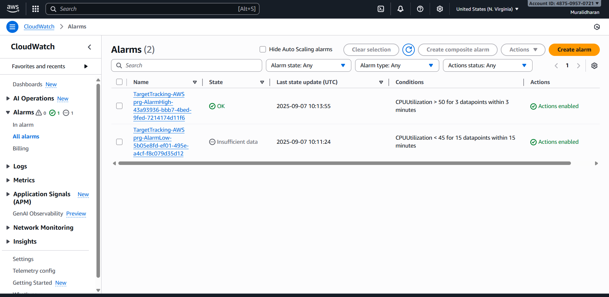
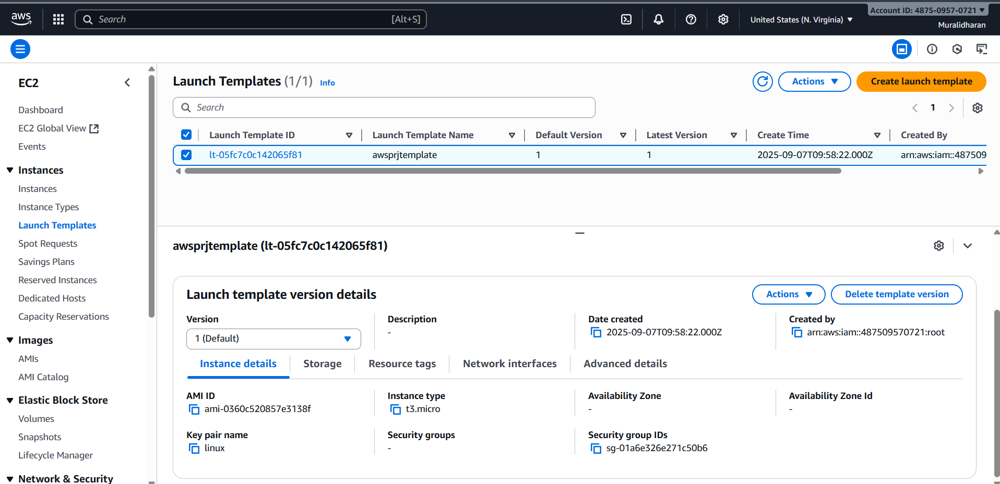
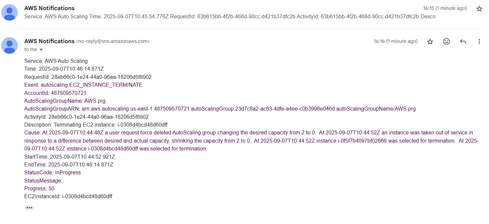
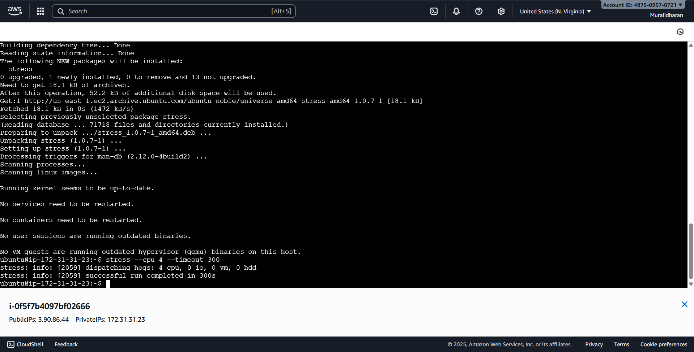

# CloudWatch Monitoring, Alerts & Auto Scaling

This project demonstrates monitoring EC2 instances using Amazon CloudWatch and automatically scaling them based on CPU utilization.

## Services Used
- Amazon EC2
- Amazon CloudWatch
- Auto Scaling Group
- Launch Template
- Amazon SNS
- Linux (Ubuntu)

## Architecture Overview
- EC2 instances launched using a launch template
- Auto Scaling Group manages instance count
- CloudWatch alarms monitor CPU utilization
- Scaling policies trigger scale-out and scale-in
- SNS sends email notifications

## Steps Performed
1. Created EC2 launch template
2. Configured Auto Scaling Group (min 1, max 3)
3. Created CloudWatch CPU utilization alarms
4. Attached target tracking scaling policies
5. Configured SNS email notifications
6. Generated CPU load using stress tool
7. Verified scale-out and scale-in actions

## Outcome
- Automatic scaling based on CPU usage
- Alerts received through SNS email notifications

## Screenshots

### CloudWatch Alarms

### Auto Scaling Group

### Launch Template

### SNS Email Notification

### CPU Stress Test

